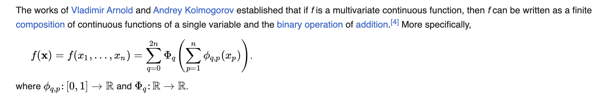
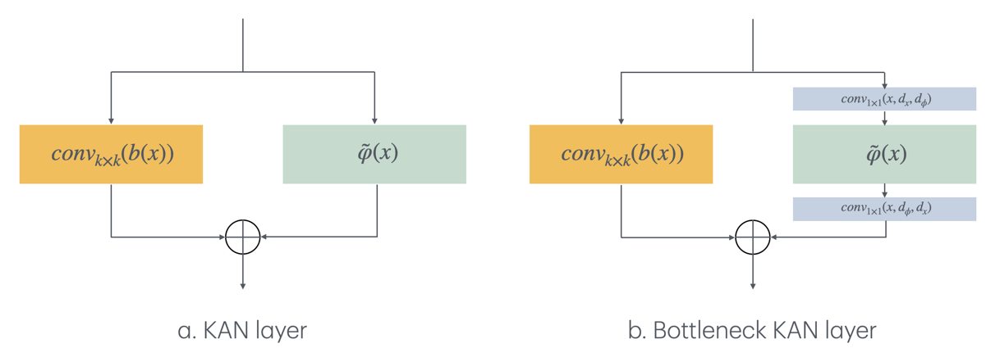

# TorchKAN: A Convolutional Kolmogorov-Arnold Networks Collection

[](https://arxiv.org/abs/2407.01092)

> [!NOTE]
> This project is forked from [IvanDrokin/torch-conv-kan](https://github.com/IvanDrokin/torch-conv-kan)

This project introduces and demonstrates the training, validation, and quantization of the Convolutional KAN model using PyTorch with CUDA acceleration. The `torchkan` evaluates performance on MNIST, CIFAR, TinyImagenet and Imagenet1k datasets.

## Introducing Convolutional KAN layers

Kolmogorov-Arnold networks rely on Kolmogorov-Arnold representation theorem:



So, from this formula, the authors of [KAN: Kolmogorov-Arnold Networks](https://arxiv.org/abs/2404.19756) derived the new architecture: learnable activations on edges and summation on nodes. MLP in opposite performs fixed non-linearity on nodes and learnable linear projections on edges.


In a convolutional layer, a filter or a kernel "slides" over the 2D input data, performing an elementwise multiplication. The results are summed up into a single output pixel. The kernel performs the same operation for every location it slides over, transforming a 2D (1D or 3D) matrix of features into a different one. Although 1D and 3D convolutions share the same concept, they have different filters, input data, and output data dimensions. However, we'll focus on 2D for simplicity.

Typically, after a convolutional layer, a normalization layer (like BatchNorm, InstanceNorm, etc.) and non-linear activations (ReLU, LeakyReLU, SiLU, and many more) are applied.

More formal: suppose we have an input image y, with N x N size. We omit the channel axis for simplicity, it adds another summations sign. So, first, we need to convolve it without kernel W with size m x m:

$S(i,j) = I(i,j)\ast K(i,j) = \sum_m\sum_n w_{m,n}I(i+m,j_n)$

Then, we apply batch norm and non-linearity, for example - ReLU:

$x = \text{ReLU}(\text{BatchNorm}(x))$

Kolmogorov-Arnold Convolutions work slightly differently: the kernel consists of a set of univariate non-linear functions. This kernel "slides" over the 2D input data, performing element-wise application of the kernel's functions. The results are then summed up into a single output pixel. More formal: suppose we have an input image y (again), with N x N size. We omit the channel axis for simplicity, it adds another summations sign. So, the KAN-based convolutions defined as:

$S(i,j) = I(i,j)\ast K(i,j) = \sum_m\sum_n \phi_{m,n}I(i+m,j_n)$

And each phi is a univariate non-linear learnable function. In the original paper, the authors propose to use this form of the functions:

$b(x)=w_b\cdot b(x) + w_s\cdot \text{spline}(x)$

And authors propose to choose SiLU as $b(x)$ activation:

$b(x) = \text{SiLU}(x) = \frac{x}{1+e^{-x}}$

To sum up, the "traditional" convolution is a matrix of weights, while Kolmogorov-Arnold convolutions are a set of functions. That's the primary difference. The key question here is - how should we construct these univariate non-linear functions? The answer is the same as for KANs: B-splines, polynomials, RBFs, Wavelets, etc.

In this repository, the implementation of the following layers is presented:

- The `KANConv1DLayer`, `KANConv2DLayer`, `KANConv3DLayer` classes represent convolutional layers based on the Kolmogorov Arnold Network, introduced in [1].

- The `KALNConv1DLayer`, `KALNConv2DLayer`, `KALNConv3DLayer` classes represent convolutional layers based on the Kolmogorov Arnold Legendre Network, introduced in [2].

- The `FastKANConv1DLayer`, `FastKANConv2DLayer`, `FastKANConv3DLayer` classes represent convolutional layers based on the Fast Kolmogorov Arnold Network, introduced in [3].

- The `KACNConv1DLayer`, `KACNConv1DLayer`, `KACNConv1DLayer` classes represent convolutional layers based on Kolmogorov Arnold Network with Chebyshev polynomials instead of B-splines, introduced in [4].

- The `KAGNConv1DLayer`, `KAGNConv1DLayer`, `KAGNConv1DLayer` classes represent convolutional layers based on Kolmogorov Arnold Network with Gram polynomials instead of B-splines, introduced in [5].

- The `WavKANConv1DLayer`, `WavKANConv1DLayer`, `WavKANConv1DLayer` classes represent convolutional layers based on Wavelet Kolmogorov Arnold Network, introduced in [6].

- The `KAJNConv1DLayer`, `KAJNConv2DLayer`, `KAJNConv3DLayer` classes represent convolutional layers based on Jacobi Kolmogorov Arnold Network, introduced in [7] with minor modifications.

- We introduce the `KABNConv1DLayer`, `KABNConv2DLayer`, `KABNConv3DLayer` classes represent convolutional layers based on Bernstein Kolmogorov Arnold Network.

- The `KABNConv1DLayer`, `KABNConv2DLayer`, `KABNConv3DLayer` classes represent convolutional layers based on ReLU KAN, introduced in [8].

### Introducing Bottleneck Convolutional KAN layers

As we previously discussed, a phi function consists of two blocks: residual activation functions (left part of diagrams below) and learnable non-linearity (splines, polynomials, wavelet, etc; right part of diagrams below).



The main problem is in the right part: the more channels we have in input data, the more learnable parameters we introduce in the model. So, as a Bottleneck layer in ResNets, we could do a simple trick: we can apply 1x1 squeezing convolution to the input data, perform splines in this space, and then apply 1x1 unsqueezing convolution.

Let's assume, we have input **x** with 512 channels, and we want to perform ConvKAN with 512 filters. First, conv 1x1 projects **x** to **y** with 128 channels for example. Now we apply learned non-linearity to y, and last conv 1x1 transforms **y** to **t** with 512 channels (again). Now we can sum **t** with residual activations.

In this repository, the implementation of the following bottleneck layers is presented:

- The `BottleNeckKAGNConv1DLayer`, `BottleNeckKAGNConv2DLayer`, `BottleNeckKAGNConv3DLayer` classes represent bottleneck convolutional layers based on Kolmogorov Arnold Network with Gram polynomials instead of B-splines.

- The `BottleNeckKAGNConv1DLayer`, `BottleNeckKAGNConv2DLayer`, `BottleNeckKAGNConv3DLayer` classes represent bottleneck convolutional layers based on Kolmogorov Arnold Network with Gram polynomials instead of B-splines.

## Prerequisites

Ensure you have the following installed on your system:

- Python (version 3.9 or higher)
- CUDA Toolkit (corresponding to your PyTorch installation's CUDA version)
- cuDNN (compatible with your installed CUDA Toolkit)

## Installation

Clone the `torchkan` repository and set up the project environment:

```bash
pip install git+https://github.com/jshn9515/torchkan.git
```

## Usage

Below is an example of a simple model based on KAN convolutions:

```python
import torch
import torch.nn as nn

import torchkan

model = nn.Sequential(
    torchkan.KANConv2DLayer(in_channels=3, out_channels=32, kernel_size=3, padding=1),
    nn.ReLU(),
    nn.MaxPool2d(kernel_size=2, stride=2),
    torchkan.KANConv2DLayer(in_channels=32, out_channels=64, kernel_size=3, padding=1),
    nn.ReLU(),
    nn.MaxPool2d(kernel_size=2, stride=2),
    nn.Flatten(),
    torchkan.KANLayer(64 * 56 * 56, 256),
    nn.ReLU(),
    nn.Dropout(0.5),
    torchkan.KANLayer(256, 10),
)

x = torch.randn(1, 3, 224, 224)
y = model(x)
assert y.shape == (1, 10)
```

You can use `get_all_kan_layers` function to list all the KAN layers in this module:

```python
import torchkan

layers = torchkan.get_all_kan_layers()
```

## Cite this Project

If you use this project in your research or wish to refer to the baseline results, please use the following BibTeX entry.

```bibtex
@misc{drokin2024kolmogorovarnoldconvolutionsdesignprinciples,
      title={Kolmogorov-Arnold Convolutions: Design Principles and Empirical Studies}, 
      author={Ivan Drokin},
      year={2024},
      eprint={2407.01092},
      archivePrefix={arXiv},
      primaryClass={cs.CV},
      url={https://arxiv.org/abs/2407.01092}, 
}
```

## Contributions

Contributions are welcome. Please raise issues as necessary.

## Acknowledgements

This repository based on [TorchKAN](https://github.com/1ssb/torchkan/), [FastKAN](https://github.com/ZiyaoLi/fast-kan), [ChebyKAN](https://github.com/SynodicMonth/ChebyKAN), [GRAMKAN](https://github.com/Khochawongwat/GRAMKAN), [WavKAN](https://github.com/zavareh1/Wav-KAN), [JacobiKAN](https://github.com/SpaceLearner/JacobiKAN), and [ReLU KAN](https://github.com/quiqi/relu_kan). And we would like to say thanks for their open research and exploration.

## References

- [1] Ziming Liu et al., "KAN: Kolmogorov-Arnold Networks", 2024, arXiv. <https://arxiv.org/abs/2404.19756>
- [2] <https://github.com/1ssb/torchkan>
- [3] <https://github.com/ZiyaoLi/fast-kan>
- [4] <https://github.com/SynodicMonth/ChebyKAN>
- [5] <https://github.com/Khochawongwat/GRAMKAN>
- [6] <https://github.com/zavareh1/Wav-KAN>  
- [7] <https://github.com/SpaceLearner/JacobiKAN>
- [8] <https://github.com/quiqi/relu_kan>
- [9] <https://github.com/KindXiaoming/pykan>
- [10] <https://github.com/Blealtan/efficient-kan>
